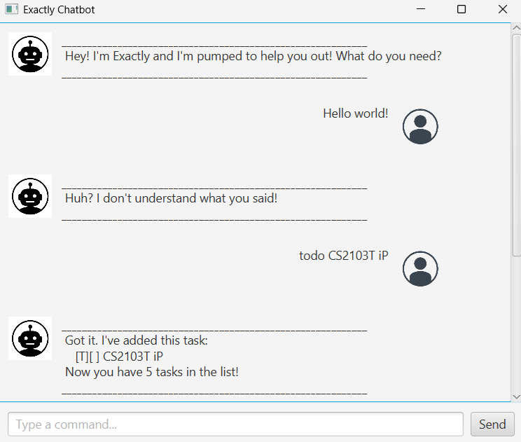

# Exactly Chatbot User Guide

Welcome to **Exactly**—a flexible task‑management chatbot you can run in the **CLI** or the **JavaFX GUI**. This guide covers every feature, shows complete usage examples (including error and duplicate‑detection messages), and walks you through installation, commands, customization, and troubleshooting.


---

## Table of Contents

1. [Introduction](#introduction)  
2. [Installation](#installation)  
3. [Running Exactly](#running-exactly)  
   1. [CLI Mode](#cli-mode)  
   2. [GUI Mode](#gui-mode)  
4. [Features & Commands](#features--commands)  
   1. [Adding a Todo](#adding-a-todo)  
   2. [Adding a Deadline](#adding-a-deadline)  
   3. [Adding an Event](#adding-an-event)  
   4. [Listing Tasks](#listing-tasks)  
   5. [Marking Tasks](#marking-tasks)  
   6. [Unmarking Tasks](#unmarking-tasks)  
   7. [Deleting Tasks](#deleting-tasks)  
   8. [Finding Tasks](#finding-tasks)  
   9. [Duplicate Prevention](#duplicate-prevention)  
   10. [Exiting](#exiting)  
5. [Error Messages](#error-messages)  
6. [Command Reference Table](#command-reference-table)  
7. [Customization & Advanced Usage](#customization--advanced-usage)  
8. [Troubleshooting](#troubleshooting)  
9. [Frequently Asked Questions](#frequently-asked-questions)  

---

## Introduction

Exactly helps you keep track of to‑dos, deadlines, and events with a simple natural‑language style. It:

* **Persists** your tasks between runs in a human‑readable text file  
* **Prevents duplicates** by checking for identical tasks before adding  
* **Offers two interfaces**: a fast CLI for terminals, and a rich JavaFX GUI  
* **Handles errors gracefully**, with clear messages to guide you  

Whether you prefer typing commands or clicking buttons, Exactly adapts to your workflow.

---

## Installation

1. **Clone or fork** the repo to your machine:
   ```bash
   git clone https://github.com/<your‑username>/exactly.git
   ```
2. **Build** with your choice of tool:
   - **Gradle**:
     ```bash
     ./gradlew clean build
     ```
3. **Locate the runnable JAR** at `build/libs/Exactly.jar`.
4. **Ensure Java 17+** is installed and JAVA_HOME is set.
   - JavaFX modules are bundled, no extra setup needed.

---

## Running Exactly

### CLI Mode

Launch in your terminal. Exactly will create `data/exactly.txt` if it does not exist:

```bash
java -cp build/libs/Exactly.jar exactly.Exactly data/exactly.txt
```

- **Interactive**: type commands and press Enter.
- **Batch**: you can pipe commands from a file:
  ```bash
  cat commands.txt | java -cp ... exactly.Exactly data/exactly.txt
  ```

### GUI Mode

Start the JavaFX window:

```bash
java -jar build/libs/Exactly.jar
```

> **Tip:** Ensure `src/main/resources/images/DaUser.png` and  
> `src/main/resources/images/DaBot.png` are packaged in the JAR so avatars display.

---

## Features & Commands

Everything starts with a **command** followed by arguments. Commands are case‑sensitive and must be entered exactly.

### Adding a Todo

**Syntax**
```
todo <description>
```
**Example**
```
todo Buy groceries
```
**Output**
```
 Got it. I’ve added this task:
   [T][ ] Buy groceries
 Now you have 1 tasks in the list!
```

### Adding a Deadline

**Syntax**
```
deadline <description> /by <yyyy-MM-dd>
```
**Example**
```
deadline Finish report /by 2025-05-01
```
**Output**
```
 Got it. I’ve added this task:
   [D][ ] Finish report (by: May 01 2025)
 Now you have 2 tasks in the list!
```

### Adding an Event

**Syntax**
```
event <description> /from <start> /to <end>
```
**Example**
```
event Team meeting /from 14:00 /to 15:00
```
**Output**
```
 Got it. I’ve added this task:
   [E][ ] Team meeting (from: 14:00 to: 15:00)
 Now you have 3 tasks in the list!
```

### Listing Tasks

**Syntax**
```
list
```
**Output**
```
 Here are the tasks in your list:
 1. [T][ ] Buy groceries
 2. [D][ ] Finish report (by: May 01 2025)
 3. [E][ ] Team meeting (from: 14:00 to: 15:00)
```

### Marking Tasks

**Syntax**
```
mark <task number>
```
**Example**
```
mark 1
```
**Output**
```
 Awesome! I’ve marked this task as done:
   [T][X] Buy groceries
```

### Unmarking Tasks

**Syntax**
```
unmark <task number>
```
**Example**
```
unmark 1
```
**Output**
```
 Got it! I’ve marked this task as not done yet:
   [T][ ] Buy groceries
```

### Deleting Tasks

**Syntax**
```
delete <task number>
```
**Example**
```
delete 2
```
**Output**
```
 Noted. I’ve removed this task:
   [D][ ] Finish report (by: May 01 2025)
 Now you have 2 tasks in the list.
```

### Finding Tasks

**Syntax**
```
find <keyword>
```
**Example**
```
find meeting
```
**Output**
```
 Here are the matching tasks in your list:
 1. [E][ ] Team meeting (from: 14:00 to: 15:00)
```

### Duplicate Prevention

If you try to add a task that already exists:
```
todo Buy groceries
```
**Output**
```
 Whoa! You already have this task! Won’t add duplicate.
```

### Exiting

**Syntax**
```
bye
```
**Output**
```
 Bye! Keep crushing it and never settle for less!
```

---

## Error Messages

Exactly checks your input and gives clear feedback:

* **Empty description**  
  “Huh? The description for a todo task cannot be empty!”
* **Missing or malformed arguments**  
  “Nope – a deadline command must have a description and a '/by' time!”
* **Out‑of‑range task number**  
  “Huh? That task number doesn’t exist! Check and try again!”
* **Unknown command**  
  “Huh? I don’t understand what you said!”
* **File I/O errors** (console only)  
  `Error loading tasks: <message>` or `Error saving tasks: <message>`

---

## Command Reference Table

| Command         | Syntax                                     | Description                         |
|-----------------|--------------------------------------------|-------------------------------------|
| Add Todo        | `todo <description>`                       | Create a new Todo task              |
| Add Deadline    | `deadline <desc> /by <yyyy-MM-dd>`         | Create a new Deadline task          |
| Add Event       | `event <desc> /from <start> /to <end>`     | Create a new Event task             |
| List            | `list`                                     | Show all tasks                      |
| Mark            | `mark <task number>`                       | Mark a task as done                 |
| Unmark          | `unmark <task number>`                     | Mark a task as not done             |
| Delete          | `delete <task number>`                     | Remove a task                       |
| Find            | `find <keyword>`                           | Search tasks by keyword             |
| Exit            | `bye`                                      | Exit the application                |

---

## Customization & Advanced Usage

* **Custom data file**: in CLI mode, you can supply any file path:
  ```
  java -cp ... exactly.Exactly /path/to/mytasks.txt
  ```
* **Automated scripts**: feed a text file of commands via `cat commands.txt | java ...`.
* **Theming GUI**: edit `app.css` in `src/main/resources` to tweak colors, fonts, padding.
* **Extending tasks**: you can subclass `Task` in code to add new types (e.g. `MeetingTask`).
* **Logging**: configure Java’s logging framework to capture debug output from storage or parser.

---

## Troubleshooting

1. **Window too small**
   - GUI defaults to **600×400**. Drag edges or set a custom size in `MainWindow.fxml`.
2. **Avatars not showing**
   - Ensure your PNGs are in `src/main/resources/images/` and packaged to `/images/...`.
3. **JavaFX errors**
   - Use **Java 17+** and include JavaFX on the module path if needed.
4. **Corrupted data file**
   - Delete or rename `data/exactly.txt`; Exactly will recreate it anew.
5. **Build failures**
   - Run `./gradlew clean` or `mvn clean` before rebuilding.
6. **Slow startup**
   - Large task files may take time; archive old tasks manually if needed.

---

## Frequently Asked Questions

**Q:** Can I manually edit the task file?  
**A:** Yes. It’s plain text. Exactly skips invalid lines but keep a backup.

**Q:** How can I back up my tasks?  
**A:** Copy the `data/exactly.txt` file to a safe location (e.g. via cron or Task Scheduler).

**Q:** Why aren’t my CSS changes appearing?  
**A:** Make sure to rebuild JAR and that `app.css` is in `src/main/resources`.

**Q:** Can I run Exactly on macOS or Linux?  
**A:** Absolutely – Java and JavaFX are cross‑platform.

```